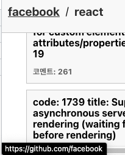
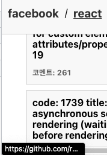
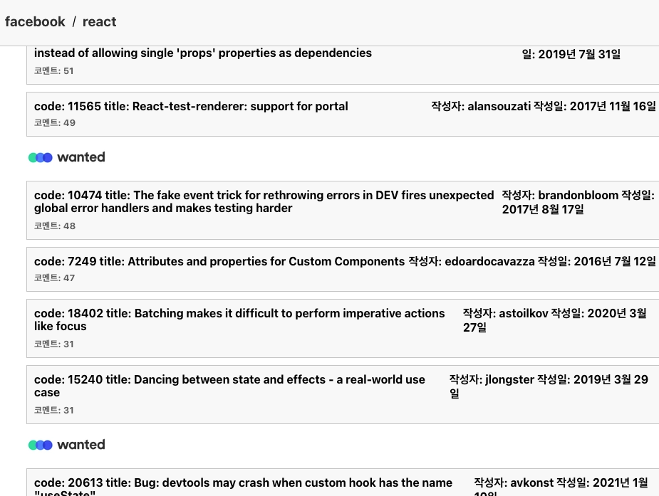
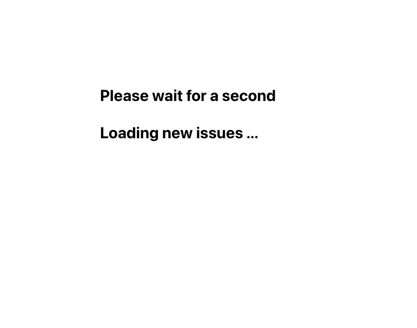
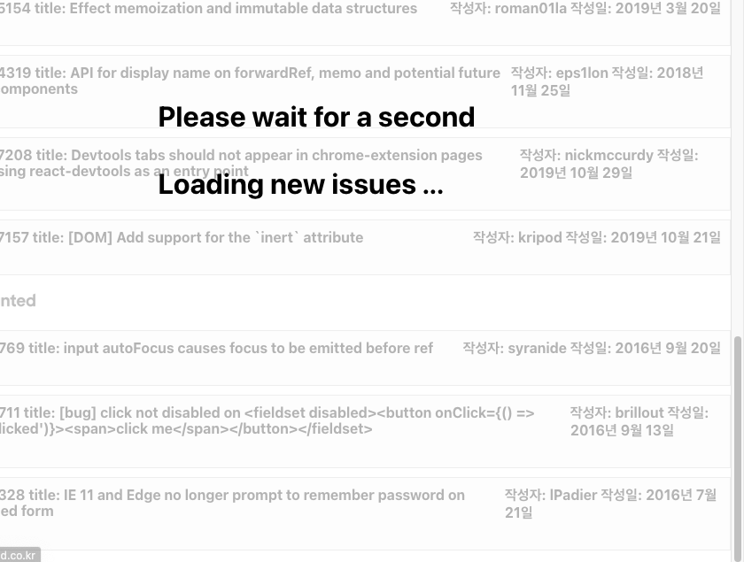
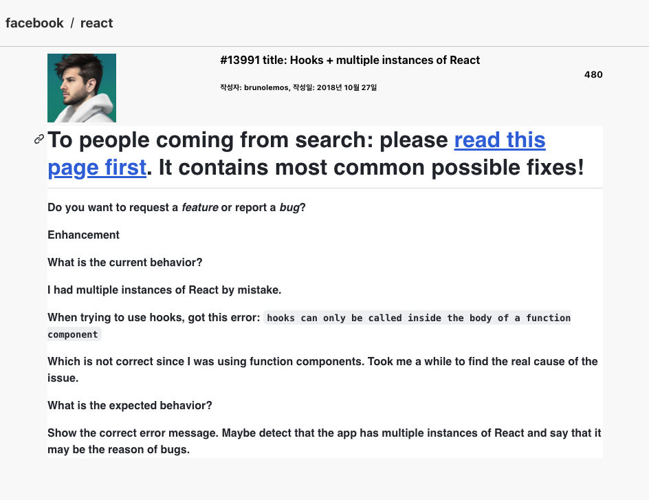
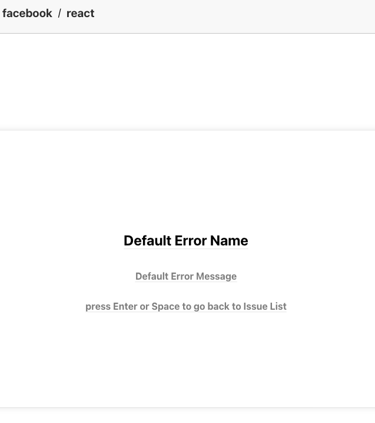

# facebook/react repository issues

---
## 실행 방법

```shell
git clone https://github.com/thumbthing/react-issues.git
npm install
npm start
```
## 기간


## Environment 세팅

---
>  API 요청 횟수 제한 해제
> 1. root 디렉터리 내에 `.env` 생성
> 2. 스크립트 추가
> ```javascript
> //.env
> REACT_APP_GITHUB_TOKEN = 본인의 github token key
>
> REACT_APP_REPO = 'https://api.github.com/repos/facebook/react'
> ```

## 목적

---
wanted pre-onboarding 2주차 개인과제

## 프로젝트 구조

---

```shell
├── API
│   ├── github.issue.ts
│   └── instance.ts
├── App.css
├── App.test.tsx
├── App.tsx
├── components
│   ├── Advertisements.tsx
│   ├── IssueItem.tsx
│   ├── Loading.tsx
│   └── layout
│       └── Header.tsx
├── index.css
├── index.tsx
├── pages
│   ├── ErrorPage.tsx
│   ├── IssuesDetailPage.tsx
│   └── IssuesListPage.tsx
├── react-app-env.d.ts
├── reportWebVitals.ts
├── setupTests.ts
├── styles
│   ├── Header.style.ts
│   ├── IssueItem.style.ts
│   ├── IssuesDetail.style.ts
│   ├── Loading.style.ts
│   └── pages
│       ├── ErrorPage.style.ts
│       └── IssuesPage.style.ts
└── types
    └── issue.ts
```

## Commit convension

---

| Type 키워드 | 사용 시점                                                             |
| ----------- | --------------------------------------------------------------------- |
| feat        | 새로운 기능 추가                                                      |
| fix         | 버그 수정                                                             |
| docs        | 문서 수정                                                             |
| style       | 코드 스타일 변경 (코드 포매팅, 세미콜론 누락 등)기능 수정이 없는 경우 |
| design      | 사용자 UI 디자인 변경 (CSS 등)                                        |
| test        | 테스트 코드, 리팩토링 테스트 코드 추가                                |
| refactor    | 코드 리팩토링                                                         |
| build       | 빌드 파일 수정                                                        |
| ci          | CI 설정 파일 수정                                                     |
| chore       | 빌드 업무 수정, 패키지 매니저 수정 (gitignore 수정 등)                |
| rename      | 파일 혹은 폴더명을 수정만 한 경우                                     |
| remove      | 파일을 삭제만 한 경우                                                 |

---

## 프로젝트 설명

`사용 라이브러리`


--

### Issue List Page
---
1. Header



- Header의 Oraganiztion / Repository Name을 클릭하면 해당 페이지로 이동
- 위치는 스크롤 이동에 상관없이 항상 최상단에 위치

---
2. IssueList

> 
>
> - Github Rest API를 활용하여 issue 들을 comment 순으로 정렬해서 요청 후 state로 관리
>
> > 2-1 Loading
> > 
> > 

> > - 스크롤이 view point가 생성된 요소의 마지막을 바라봤을때 Loading 페이지를 기존 레이아웃에 표시
> > 데이터 요청이 끝나면 Loading 상태를 해제 후 렌더링을 하지 않도록 설정

---

3. DetailPage

> 
> 
>
> - 리스트 페이지와 마찬가지로 api 요청 시작시 Loading 페이지 렌더 후 렌더링 삭제
> - 공통 된 헤더 요소 / 특정 이슈에 대한 페이지 뷰
> - Markdown 렌더링 라이브러리 `@uiw/react-md-editor`로 Markdown으로 작성된 문자열 렌더

---

 4. Error

> 

```javascript
    const [isError, setIsError] = useState<ErrorType>({ name: 'Default Error Name', < > message: 'Default Error Message' });

    const handleError = (error: ErrorType | unknown) => {
        if (error instanceof Error) {
            setIsError(error);
        } else {
            const unOccuredError = new Error('unoccured error');
            setIsError(unOccuredError);
        }
    };

    const clearErrorAfterHandled = () => {
        setIsError({ name: '', message: '' });
    };
 ```
>
>
> - App에서 관리 중인 state를 기반으로 각 페이지에서 에러가 발생할 경우 Error의프러퍼티를 전달하여 name, message, status를 페이지에 렌더
> - 에러 핸들링 이후 Erro state를 초기화 후 List Page로 Redirect